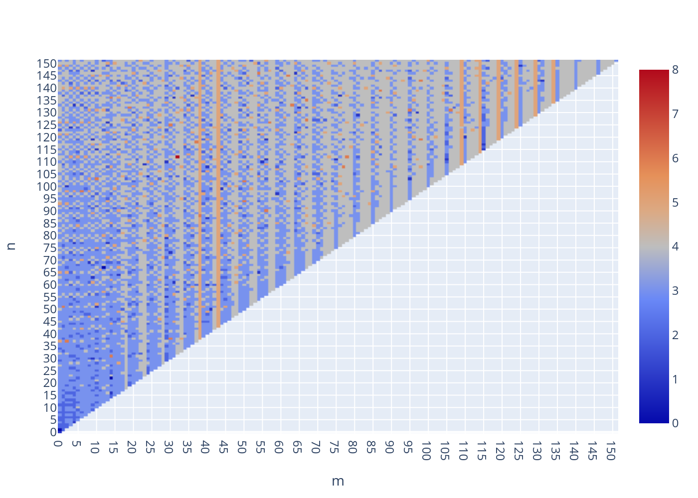
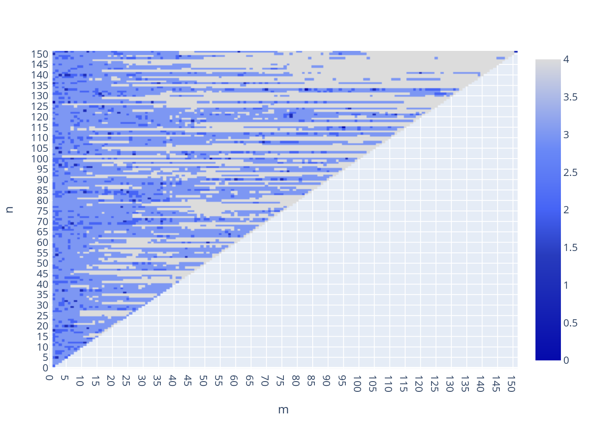

# Spherical Harmonics 

## Overview 

A possibile way to represent the exterior gravitational field of non-spherical objects is 
by exploiting a spherical harmonics expansion of its field. 

```math
\begin{equation}
    U = \frac{\mu}{R}\sum_{n=0}^\infty\sum_{m=0}^n \left(\frac{R}{r}\right)^{n+1}\left(\bar{C}_{nm}\cos(m\lambda) + \bar{S}_{nm}\sin(m\lambda)\right)\,\bar{P}_{nm}(\sin\varphi)
\end{equation}
```
with dimensionless coefficients $\bar{C}_{nm}$ and $\bar{S}_{nm}$, $R$ the semimajor 
axis of the reference ellipsoid belonging to the model, $\mu$ the gravitational parameter 
and $\bar{P}_{nm}$ the fully normalized associated Legendre polynomials of degree $n$ and order $m$. Here the normalization is performed using the following expression, as for [kaula2013](@cite):

```math
\begin{equation}
    N_{nm} = \sqrt{\frac{(2n+1)(n-m)!(2-\delta_{m0})}{(n+m)!}}
\end{equation}
```
such that 

```math 
\begin{equation*}
    \bar{P}_{nm} = N_{nm} \, P_{nm}, \qquad \bar{C}_{nm} = \cfrac{C_{nm}}{N_{nm}}
\end{equation*}
```

Denoting the cartesian coordinates of the satellite position $(x,y,z)$ in the body 
frame of the body, their relation with the spherical coordinates used here are:
```math
\begin{align*}
    x &= r\cos\varphi\cos\lambda \\
    y &= r\cos\varphi\sin\lambda \\
    z &= r\sin\varphi
\end{align*}
```
where here $r\geq 0$, $\varphi\in [-\pi/2, \pi/2]$ and $\lambda\in[0, 2\pi]$. In the literature 
instead of $\varphi$, mostly the **colatitude** $\vartheta=\pi/2-\varphi$ is used. Here 
the **latitude** is preferred because its domain coincides with the range of the inverse 
trigonometric functions `arcsin` and most notably `arctan`.

## Algorithmic implementation

While Eq. 1 is the standard format of a spherical harmonics expansion, algorithmic implementation takes advantages of the recurrence relations for Legendre polynomials as well as for the computation of $\sin m\lambda$ and $\cos m\lambda$.

This allows an efficient computation of the geopotential and the resulting acceleration as a function of the cartesian coordinates of the satellite.

### Recurrence relations

According to [cunningham1970, montenbruck](@cite), defining:

```math
\begin{align*}
    V_{nm} &= \left(\frac{R}{r}\right)^{n+1} P_{nm}(\sin\varphi) \cos m\lambda \\
    W_{nm} &= \left(\frac{R}{r}\right)^{n+1} P_{nm}(\sin\varphi) \cos m\lambda 
\end{align*}
```

Such that:

```math 
\begin{equation}
    U = \frac{\mu}{R}\sum_{n=0}^\infty\sum_{m=0}^n \, C_{nm}V_{nm} + S_{nm}W_{nm}
\end{equation}
```

and using some Legendre polynomials recurrence relations [montenbruck](@cite), $V_{nm}$ and $W_{nm}$ may be expressed by the following recurrence relationships:

```math 
\begin{align*}
    V_{nn} &= (2n-1)\bigg(X V_{n-1,n-1} - Y W_{n-1, n-1} \bigg) \\
    W_{nn} &= (2n-1)\bigg(X W_{n-1,n-1} + Y V_{n-1, n-1} \bigg) \\
\end{align*}
```

and 

```math 
\begin{align*}
    V_{nm} &= \left(\cfrac{2n-1}{n-m}\right) \, Z V_{n-1,m} - \left(\cfrac{n+m-1}{n-m}\right) \, \bar{R} V_{n-2,m}\\
    W_{nn} &= \left(\cfrac{2n-1}{n-m}\right) \, Z W_{n-1,m} - \left(\cfrac{n+m-1}{n-m}\right) \, \bar{R} W_{n-2,m} \\
\end{align*}
```

starting from

```math
\begin{equation*}
    V_{00} = \frac{R}{r}, \qquad W_{00} = 0
\end{equation*}
```

where 

```math 
    X = \cfrac{xR}{r^2}, \qquad
    Y = \cfrac{yR}{r^2}, \qquad
    Z = \cfrac{zR}{r^2}, \qquad
    \bar{R} = \cfrac{R^2}{r^2}
```

With this approach, in order to compute all $V_{nm}$ and $W_{nm}$ with $0\leq m \leq n \leq N$, 
first the zonal terms must be computed with $V_{n0}$ recurrence. The corresponding values 
of $W_{n0}$ are all identical to zero. Once the zonal terms are compute, the tesseral terms can 
be computed using the recurence relations for $V_{nn}$ and $W_{nn}$. Finally, the other 
terms can be computed using the recurence relations for $V_{nm}$ and $W_{nm}$.

### Normalization recurrences

In analogy to the recurrence pattern used for $V_{nm}$ and $W_{nm}$, a recurrence pattern for 
the normalization factor is build. The recurrence pattern follow the same of the factors, thus a 
recurrence for zonal, tesseral and sectorial terms is needed.

For zonal case, since Eq. 2 simplifies, no recurrence is used:

```math 
    N_{n0} = \sqrt{(2n+1)},\, \quad n=0,...,N
```

For the tesseral terms:

```math 
    N_{n+1, n+1} = \sqrt{ \frac{2n+1}{(2n)(2n-1)^2} \, \frac{2-\delta_{n, 0}}{2-\delta_{n-1,0}} } \, N_{n, n}, \, \quad n=1,...,N
```

And, finally, for the sectorial:

```math 
    N_{n, m+1} = \sqrt{ \frac{1}{(n-m)(n+m+1)(2-\delta_{m0})} } \, N_{n, m}, \, \quad n=2,...,N
```

### Recurrences stability

The recursions presented here are stable, which means that small numerical errors in the 
computation of low-order terms do not lead to meaningless results for high orders. 
In the following figure, the computation of $V_{nm}$ is perfomed with `Float64` and `Float128` 
and the relative logarithmic error is shown as a measure of the recurrence stability. 
In particular, the following quantity is computed and shown:

```math 
\begin{equation*}
    \delta V_{nm} = 18 + \log_{10} \bigg|\frac{V_{nm}^{128} - V_{nm}^{64}}{V_{nm}^{128}} \bigg|
\end{equation*}
```

Note that this is directly the number of digits different from `Float128`, which has 18 digits.  

```@raw html
<div align="center">
    
</div>
```

Similar results are obtained for $W_{nm}$.
As a rule of thumb, one can expect to loose 2-3, 4-5, and 5-6 digits when evaluating these 
functions up to orders 15, 50, and 100, respectively.

Equivalently, the same error analysis is performed for the normalization factors recurrences, resulting in the following $\delta N_{nm}$ relative error:

```@raw html
<div align="center">
    
</div>
```

### Acceleration computation 

The acceleration can be directly computed using the $V_{nm}$ and $W_{nm}$ factors [cunningham1970, montenbruck](@cite) as:

```math 
\ddot{x} = \frac{\mu}{R^2}\sum_{n,m}\ddot{x}_{nm}, \quad \ddot{y} = \frac{\mu}{R^2}\sum_{n,m}\ddot{y}_{nm}, \quad \ddot{z} = \frac{\mu}{R^2}\sum_{n,m}\ddot{z}_{nm}
```

with partial accelerations, using normalized quantities:

```math 
\begin{align*}
    \ddot{x}_{nm} &\overset{(\mathrm{m=0})}{=} \eta_n \left( -\bar{C}_{n0} \bar{V}_{n+1,1} \right) \\
                  &\overset{(\mathrm{m>0})}{=} \xi_{n,m} \left( -\bar{C}_{nm} \bar{V}_{n+1,m+1} -\bar{S}_{nm} \bar{W}_{n+1,m+1} \right) + \chi_{n,m} \left( \bar{C}_{nm} \bar{V}_{n+1,m-1} +\bar{S}_{nm} \bar{W}_{n+1,m-1} \right) \\ 
    \ddot{y}_{nm} &\overset{(\mathrm{m=0})}{=} \eta_n \left( -\bar{C}_{n0} \bar{W}_{n+1,1} \right) \\
                  &\overset{(\mathrm{m>0})}{=} \xi_{n,m} \left( -\bar{C}_{nm} \bar{W}_{n+1,m+1} +\bar{S}_{nm} \bar{V}_{n+1,m+1} \right) + \chi_{n,m} \left( -\bar{C}_{nm} \bar{W}_{n+1,m-1} +\bar{S}_{nm} \bar{V}_{n+1,m-1} \right) \\
    \ddot{z}_{nm}  &= \beta_{n,m} \left( -\bar{C}_{nm} \bar{V}_{n+1,m} -\bar{S}_{nm} \bar{W}_{n+1,m} \right)
\end{align*}
```

here the following coeffients are introduced: 

```math 
\begin{align*}
    \eta_n &= \frac{N_{n0}}{N_{n+1,1}} = F_{n,0,n+1,1} \\
    \xi_{nm} &= \frac{1}{2}\, \frac{N_{nm}}{N_{n+1,m+1}} = \frac{1}{2} \,F_{n,m,n+1,m+1}\\ 
    \chi_{nm} &= \frac{1}{2}(n-m+2)(n-m+1)\,\frac{N_{nm}}{N_{n+1,m-1}} = \frac{1}{2}(n-m+2)(n-m+1)\, F_{n,m,n+1,m-1} \\ 
    \beta_{nm} &= (n-m+1)\,\frac{N_{nm}}{N_{n+1,m}} = (n-m+1)\,F_{n,m,n+1,m}
\end{align*}
```

where we have define $F_{n,m,p,q}$ as the normalization factor ratio.

## References 

* [kaula2013](@cite) Kaula, Courier Corporation (2013).
* [cunningham1970](@cite) Cunningham, Celestial Mechanics (1970).
* [montenbruck](@cite) Montenbruck, Springer (2000).
