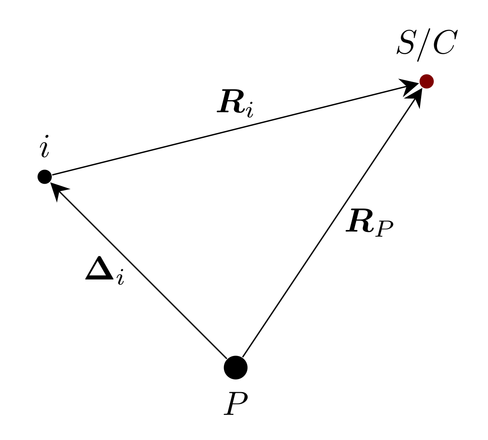

# Point Masses

## Restricted Two-Body Problem

In the restricted two-body problem of astrodynamics, the motion of artificial objects is studied
within the context of the gravitational interaction between two massive bodies. This problem 
simplifies the broader N-body problem by considering one of the bodies, typically the more massive one, 
as the primary focus of interest, while the influence of all other celestial bodies is neglected. 
_This assumption is valid when the mass of the test particle is significantly smaller than that of the primary body._

Mathematically, the motion of the test particle with respect to the primary body can be described 
by Newton's law of universal gravitation. The equation governing the dynamics of the test particle's 
position vector $\boldsymbol{R}$ relative to the primary body is expressed as:

```math
\begin{equation}
    \boldsymbol{\ddot{R}} = - \frac{\mu}{R^3} \,\boldsymbol{R} 
\end{equation}
```

where $\mu$ is the gravitational parameter of the primary body and $R$ the distance between 
the primary and the test particle.

### Partials 

Understanding the sensitivity of the particle's acceleration to changes in position is crucial 
for trajectory analysis and orbit determination. In this section the partials of the two-body 
gravity acceleration $\boldsymbol{a}$, w.r.t. the state components (e.g. position, $\boldsymbol{R}$
and velocity $\boldsymbol{V}$) as well as the model parameters (e.g. $\mu$) are reported.

```math
\begin{align*}
    \cfrac{\partial a_i}{\partial R_j} &= - \mu  \left(\cfrac{\delta_{ij}}{R^3} - \cfrac{3R_iR_j}{R^5}\right) \\
    \cfrac{\partial a_i}{\partial V_j} &= 0 \\
    \cfrac{\partial a_i}{\partial \mu} &= \cfrac{a_i}{\mu}
\end{align*}
```

## Restricted N-Body Problem

Incorporating third-body perturbations into the restricted two-body problem introduces 
additional complexities to the dynamics of the system. In this scenario, the gravitational 
influence of a third celestial body, besides the primary and secondary bodies, is considered. 
This perturbation is crucial in accurately modeling the motion of artificial objects, especially 
in scenarios where the influence of other celestial bodies cannot be neglected.

Generally speaking, in a barycentric system ($B$), the gravitational acceleration of a test 
particle under the influence of $N$ bodies can be written as:

```math
\begin{equation}
    \boldsymbol{a}_B^{SC} = - \sum_i^N\frac{\mu_i}{R_i^3} \,\boldsymbol{R}_i 
\end{equation}
```

where $\boldsymbol{R}_i$ is the vector the $i$-th body to the test particle. 


```@raw html
<div align="center">
    
</div>
```

It is often more useful to describe the motion of the particle interest with respect to 
some central body, say $\mathcal{P}$, instead of using the barycentric representation.
With reference to the previous image, then:

```math
\begin{equation}
    \boldsymbol{a}_{P}^{SC} = - \frac{\mu_P}{R_P^3} \,\boldsymbol{R}_P - \sum_{i}^N\, \mu_i\left(\frac{\boldsymbol{R}_{i}}{{R}_{i}^3} - \frac{\boldsymbol{\Delta}_{i}}{{\Delta}_{i}^3} \right)
\end{equation}
```
here $\boldsymbol{\Delta}_i = \boldsymbol{R}_P - \boldsymbol{R}_i$. 
The previous might also be written as:

```math
\begin{align*}
    \boldsymbol{a}_{P}^{SC} &= - \sum_i^N\frac{\mu_i}{R_i^3} \,\boldsymbol{R}_i  + \sum_{i}^N\, \mu_i\frac{\boldsymbol{\Delta}_{i}}{{\Delta}_{i}^3} \\
    &= \boldsymbol{a}_B^{SC} + \sum_{i}^N\, \mu_i\frac{\boldsymbol{\Delta}_{i}}{{\Delta}_{i}^3} \\
    &= \boldsymbol{a}_B^{SC} - \boldsymbol{a}_B^{P}
\end{align*}
```

Where here $\boldsymbol{a}_B^{SC}$ are the direct contributions to the test particle, 
($SC$), and $\boldsymbol{a}_B^{P}$ are the direct contributions to the planet $P$ accelerations.

!!! note "Ephemeris Restricted N-Body Problem"

    When conducting numerical integration of the test particle trajectory using ephemerides 
    to gather body positions, it's crucial to consider the computation of $\boldsymbol{a}_B^{P}$. 
    Ephemerides are typically generated using specific gravitational models. 
    If the gravitational model employed in the current simulation differs from that used in the 
    ephemerides, discrepancies may arise:

    ```math 
    \begin{equation*}
        \boldsymbol{a}_B^{P} \neq \boldsymbol{a}_E^{P}
    \end{equation*}
    ```

    Here, $\boldsymbol{a}_E^{P}$ represents the direct acceleration contributions on planet 
    $P$ as extracted from the ephemeris file. If the accelerations are not aligned, it's 
    necessary to adjust $\boldsymbol{a}_{P}^{SC}$ accordingly:

    ```math 
    \begin{equation*}
        \boldsymbol{a}_{P}^{SC} = \boldsymbol{a}_B^{SC} - \boldsymbol{a}_E^{P}
    \end{equation*}
    ```

### Partials 

In this section the partials of the restricted N-Body problem acceleration $\boldsymbol{a}_{P}^{SC}$, 
w.r.t. the state components (e.g. position, $\boldsymbol{R}_P$ and velocity 
$\boldsymbol{V}_P$) as well as the model parameters (e.g. $\mu_i$) are reported.
To ease the notation, we will drop $P$ from the state components. Moreover:

```math 
\begin{align*}
    \boldsymbol{a}_{P}^{SC} = \boldsymbol{a} &= - \sum_i^N\frac{\mu_i}{R_i^3} \,\boldsymbol{R}_i  + \sum_{i}^N\, \mu_i\frac{\boldsymbol{\Delta}_{i}}{{\Delta}_{i}^3} 
    = - \frac{\mu}{R^3} \,\boldsymbol{R}  - \sum_i^{N-P}\, \frac{\mu_i}{R_i^3}  \,\boldsymbol{R}_i + \sum_{i}^N\, \mu_i\frac{\boldsymbol{\Delta}_{i}}{{\Delta}_{i}^3} \\ 
    &= \boldsymbol{f}(\boldsymbol{R}, \mu) + \sum_i^{N-P}\, \boldsymbol{f}(\boldsymbol{R_i}, \mu_i) - \sum_{i}^N\, \boldsymbol{f}(\boldsymbol{\Delta_i}, \mu_i) 
\end{align*}
```

where here $\boldsymbol{f}(\boldsymbol{q}, \mu) = -\mu\cfrac{\boldsymbol{q}}{q^3}$.   
Note that the partials of $\boldsymbol{f}$ could be then written as for the two-body problem:

```math 
\begin{align*}
    \frac{\partial f_i}{\partial q_j} = - \frac{\mu}{q^3}  \left(\delta_{ij} - \cfrac{3q_iq_j}{q^2}\right)
\end{align*}
```

Therefore:

```math 
\begin{align*}
    \frac{\partial a_i}{\partial R_j} &= \frac{\partial f_i(\boldsymbol{R}, \mu)}{\partial R_j} +  \sum_k^{N-P}\frac{\partial f_i(\boldsymbol{R_k}, \mu_k)}{\partial R_j} 
    =  \frac{\partial f_i(\boldsymbol{R}, \mu)}{\partial R_j} +  \sum_k^{N-P}\frac{\partial f_i(\boldsymbol{R_k}, \mu_k)}{\partial \boldsymbol{R_k}}\, \frac{\partial \boldsymbol{R_k}}{\partial R_j} \\ 
    &=  \frac{\partial f_i(\boldsymbol{R}, \mu)}{\partial R_j} +  \sum_k^{N-P}\sum_l\frac{\partial f_i(\boldsymbol{R_k}, \mu_k)}{\partial {R_{k, l}}}\, \frac{\partial {R_{k, l}}}{\partial R_j} 
    =  \frac{\partial f_i(\boldsymbol{R}, \mu)}{\partial R_j} +  \sum_k^{N-P}\sum_l\frac{\partial f_i(\boldsymbol{R_k}, \mu_k)}{\partial {R_{k, l}}}\, \delta_{lj} \\ 
    &=  \frac{\partial f_i(\boldsymbol{R}, \mu)}{\partial R_j} +  \sum_k^{N-P}\frac{\partial f_i(\boldsymbol{R_k}, \mu_k)}{\partial {R_{k,j}}}\, \\ 
    &= - \frac{\mu}{R^3}  \left(\delta_{ij} - \cfrac{R_iR_j}{R^2}\right) - \sum_k^{N-P} \frac{\mu_k}{R_k^3}  \left(\delta_{ij} - \cfrac{R_{k,i}R_{k,j}}{R_k^2}\right) \\
    &= - \sum_l^{N} \frac{\mu_l}{R_l^3}  \left(\delta_{ij} - \cfrac{R_{l,i}R_{l,j}}{R_l^2}\right)
\end{align*}
```